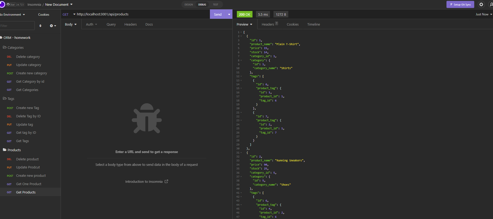
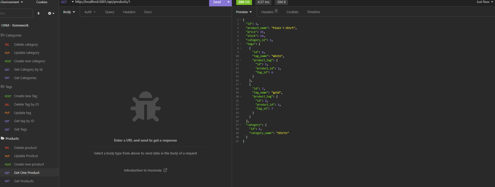
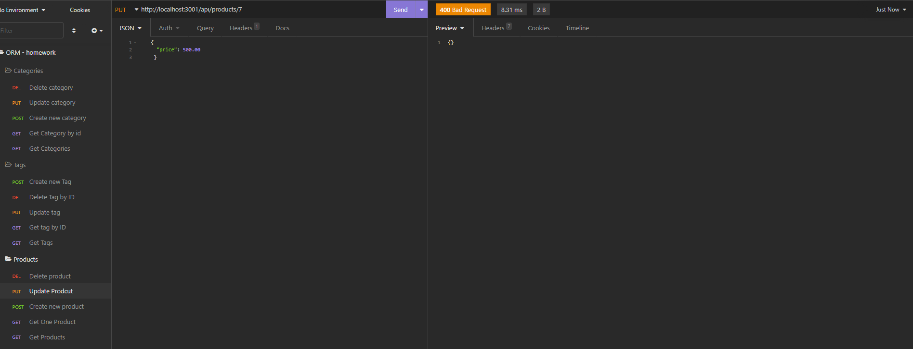
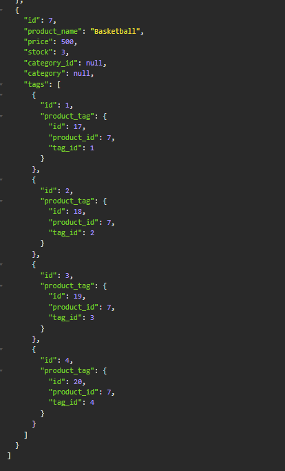
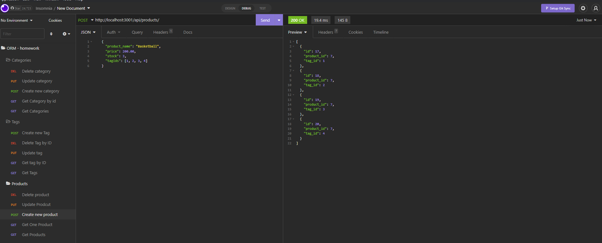
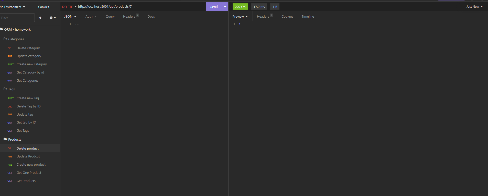
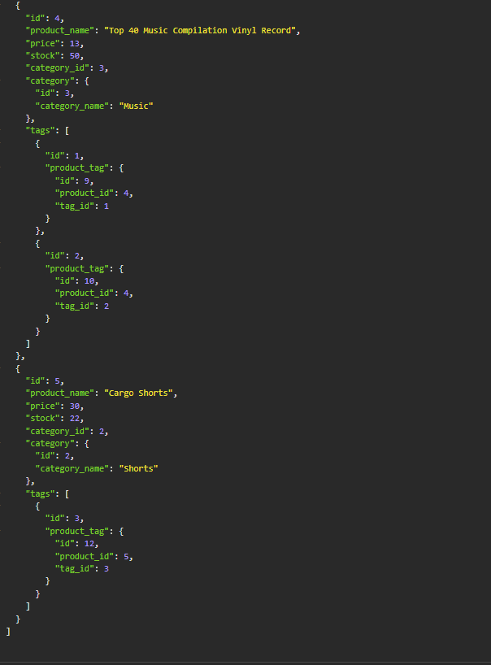

  

  # E-Com-BackEnd

  [](https://opensource.org/licenses/MIT)

  [A video of the application can be viewed here ](https://drive.google.com/file/d/1oQ2bH1ti0dCaCGvywFvSsONmW50D-BfS/view)

  [The repository can be viewed here.](https://github.com/dgourley84/E-Com-BackEnd)

  ---
  
# Description

  This project is an E-Commerce backend built in node js using sequelize as a database and express router to build the API that returns the data to the user in JSON form. The application allows users to interact with a hypothetical stores inventory system including categories which products belong to, the products themselves, including the name, price, stock and which category it belongs to.

## Contents
1. [About](#about)
    1. [Usage](#usage)
    2. [User Story](#user-story)
    3. [Acceptance criteria](#acceptance-criteria)
    4. [Visuals](#visuals)
2. [Installation](#installation)
3. [License](#license)
4. [Contributing](#contributing)
5. [Tests](#tests)
6. [Authors and acknowledgment](#authors-and-acknowledgments)
7. [Questions](#questions)
---
## About

   This project is an E-Commerce backend built in node js using sequelize as a database and express router to build the API that returns the data to the user in JSON form. The application allows users to interact with a hypothetical stores inventory system including categories which products belong to, the products themselves, including the name, price, stock and which category it belongs to. Finally, the app allows users to interact with the tags associated with the products. The features that users have access to are as follows:
  
  - Getting the list of categories, products or tags
  - Getting a specific category, product or tag
  - Changing information in a specific category, produc or tag
  - deleting a specific category, product or tag

  This meets all aspects of the acceptance criteria.s to. 


---
## Usage
  
  install the applicaiton dependancies using the above command, initialize the database in mysql by running mysql -u <user> -p <password>. Then, source db/schema.sql. The mysql interface can be exited using the command exit and seeding the database can take place using the command node seeds/index. Now that the database is initialized and seeded, run npm start to run the application and open the url in insomnia to interact with the api as you wish.

---
## User Story

```bash
  AS A manager at an internet retail company
  I  WANT a back end for my e-commerce website that uses the latest technologies
  SO THAT my company can compete with other e-commerce companies
  ```

---

## Acceptance Criteria

  ```bash
GIVEN a functional Express.js API
WHEN I add my database name, MySQL username, and MySQL password to an environment variable file
THEN I am able to connect to a database using Sequelize
WHEN I enter schema and seed commands
THEN a development database is created and is seeded with test data
WHEN I enter the command to invoke the application
THEN my server is started and the Sequelize models are synced to the MySQL database
WHEN I open API GET routes in Insomnia Core for categories, products, or tags
THEN the data for each of these routes is displayed in a formatted JSON
WHEN I test API POST, PUT, and DELETE routes in Insomnia Core
THEN I am able to successfully create, update, and delete data in my database
  ```
  
---
## Visuals:
  
  In insomnia, the requests and repsonses are as follows:

  ##  Getting all items
  

  The response here is the entire contents of the database table that has been targeted

  ##  Getting a specific item
  

  The response here is the content of the database table that matches to the id at the end of the request as a paramater.

  ##  Changing an item at a given endpoint
  
  The response here is the effected item in the database.
  

  ##  Adding an item at a given endpoint
  
  The response here is the effected item in the database.

   ##  Deleting an item at a given endpoint

  

  The response here is the effected item in the database.
  
  

---

## Installation:

  To Install and run this application yourself, follow the step(s) below: 
  ```bash
  npm i
  ```

---
## License
  License used for this project - MIT
  * For more information on license types, please reference this website
  for additional licensing information - [https: //choosealicense.com/](https://choosealicense.com/).
---

## Contributing:

  To contribute to this application, create a pull request.
  Here are the steps needed for doing that:
  - Fork the repo
  - Create a feature branch (git checkout -b NAME-HERE)
  - Commit your new feature (git commit -m 'Add some feature')
  - Push your branch (git push)
  - Create a new Pull Request
  Following a code review, your feature will be merged.

---

## Tests:

  This app does not have any tests.

---
## Authors & Acknowledgments

  Dallas Gourley

---

## Questions:
* GitHub Username: [dgourley84](https://github.com/dgourley84)
* GitHub Email: (dallas.gourley@yahoo.com)


